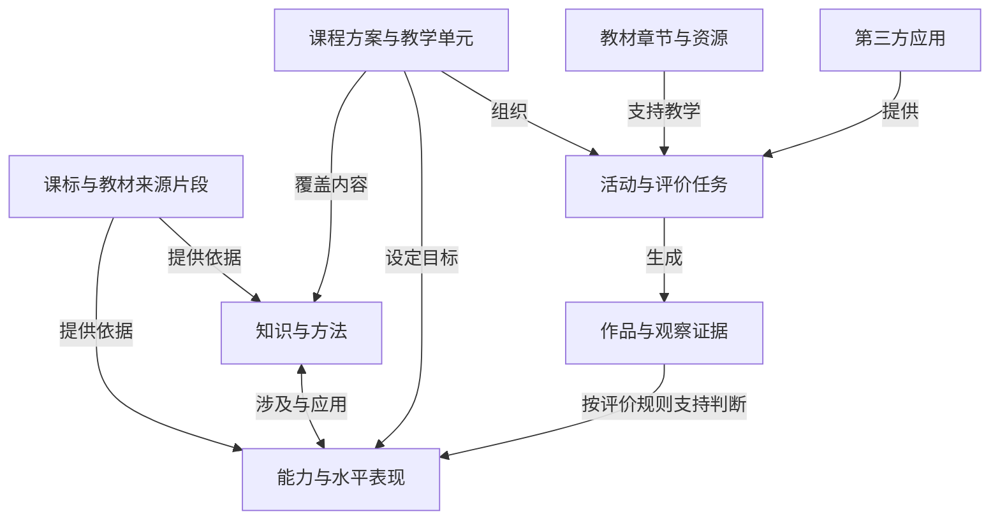

# 知识、能力、课程与应用的联合架构提案

日期：2026-09-06。状态：设计提案，未迁移或发布数据。承接 007 审查，不能代替尚未完成的全图语义复核。

## 1. 已核实的现状

读取线上 `/zhishi/`、`atlas.html`、`coverage.html` 的实际 HTML 与内嵌数据，不仅依赖首页说明。

- 知识浏览器：10 学科、400 节点、673 边；知识点 269、能力×水平 69、主题 37、材料 25。
- 关系有 9 类，包括 prerequisite、component_of、recommended、refines、applies、instantiates、sequence、sibling、content_relation。
- 浏览器数据实际状态为 confirmed 637、proposed 28、disputed 8。首页“673 条都已确认”的描述与此不一致。confirmed 没有充分的人类审定依据，导入时不得直接升级为教师确认。
- 浏览器标为可归因的边 242，即约 36%；首页显示 38%。二者需要同一数据快照生成，且这个比例不是准确率。
- 部分历史审计页仍引用能力图谱 2,971 节点 / 6,622 边；当前能力底座为 3,671 / 6,695。不同版本报告必须显式绑定各自输入快照。
- atlas 的 prerequisite 示例方向是“目标 → 所需基础”；现有能力图谱是“基础 → 目标”。component_of 示例为“子项 → 母项”，但 atlas 归因遍历把两类 target 都视为更基础，不能直接复用。
- 知识库当前按 kp/ab/th/mt 前缀分配评价策略：知识默认二元掌握、能力默认水平、主题材料不评级。应保留不对主题材料直接评级的边界，但不能由类型前缀单独决定测量有效性。

来源：[知识站首页](https://k12.yongle.school/zhishi/)、[实际图谱数据与遍历代码](https://k12.yongle.school/zhishi/atlas.html)、[教材覆盖原型](https://k12.yongle.school/zhishi/coverage.html)。页内旧审计结论不是本次独立验证结论。

## 2. 产品结构：共享坐标，多个视图

知识定义学习对象，能力定义表现要求，课程把它们组织成教学活动。知识和能力是多对多关系，不强制上下级；课程是带版本、目标和编排的组织结构。

箭头为明确业务关系，不代表必要先修。证据支持某次、某条件下的判断，不自动证明跨情境稳定掌握。

建议三个主要入口：

1. 教师从“课程目录”进入，看本单元知识、能力目标、活动和证据缺口。
2. 教研从“知识与能力”进入，看出处、适用范围、水平描述、关系和争议。
3. 应用开发者从“映射工作台”进入，提交任务，核对候选映射，导出或经 MCP 查询。

## 3. 数据对象与边界

| 对象 | 负责描述 | 关键边界 |
|---|---|---|
| SourceFragment | 文档版本、栏目、页码、原文或位置、文件指纹 | 区分课标内容要求、学业质量、教学建议、教材例题 |
| Knowledge | 概念、事实、原理、程序性方法、别名 | kp 前缀不保证纯概念，例如显微镜使用还包含程序 |
| Capability | 有条件的表现、内容对象、学段范围 | 沿用 ca_ ID；语义变更需版本或新 ID，不原位换义 |
| PerformanceLevel | 某能力的具体水平描述、适用任务与证据规则 | 旧 ab@L3 是待对齐水平；L3 不自动等于三年级或另一库的第三级 |
| CurriculumFramework | 国家、地区或学校课程方案、学科与学段 | 和具体教材版本分开 |
| TextbookEdition / Section | 出版社、版次、年份、册次、章节目次与页码 | 教材编排不是知识天然先修，目录必须核实 |
| CourseDesign / Unit | 可版本化课程设计、目标、课时、活动顺序 | 一套教材可支撑多套课程，单元可跨学科、跨教材 |
| Activity / AssessmentTask | 学习活动、输入、支持条件、产物、评价规则 | 活动练习目标与评价目标分别标记 |
| Resource / Theme | 文章、图片、仿真、材料及主题 | 支持教学，不直接持有学生掌握分数 |
| Alignment | 以上对象之间有理由、证据、范围和审阅状态的映射 | 多对多；覆盖知识不意味着已经评价相关能力 |

未来如有学生证据，再增加独立权限域的 EvidenceObservation 与 LearnerJudgment。当前试点沿用匿名模拟作品，不为这次架构设计引入学生身份与成绩采集。课程实际开班和个人学习记录也不属于公共图谱。

## 4. 先做跨库映射层

保留两库原 ID 与快照，联合引用采用 `{namespace, id, revision}`。无需先把两库合成一张物理节点表。

首批必须建立：

- 知识 ↔ 能力：`involves_knowledge`，包括内容范围；一个知识可对应识别、解释、应用、探究等不同表现。
- 旧能力×水平 ↔ ca_：`exact / broader / narrower / related` 候选对齐。exact 也需逐项核验对象、条件、水平、范围和证据，名称相同不足以成立。
- 教材章节 → 知识：`covers`，记录原页与覆盖深度，不只做关键词匹配。
- 课程单元 → 能力：`targets`；活动 → 能力分别用 `practices` 和 `assesses`。
- 任务 → 证据规则：`elicits`；资源 → 任务：`supports`。

映射最小记录：mappingId、两端带版本引用、关系类型、适用范围、理由、来源、生成者、审阅者、状态、创建时间、被替代记录。未对齐是一种有效结果，不能为了连满图硬匹配。

别名解决“勾股定理 / 直角三角形三边关系”的候选召回，不能直接当作精确等价确认。覆盖率分母必须是一份核实过、带版本的目录或目标清单。

## 5. 关系方向和推断权限

统一 API 方向如下；旧数据通过适配器转换，并保存原字段和转换版本，不覆盖原记录。

| 类型 | 统一方向 | 允许用途 |
|---|---|---|
| prerequisite | 基础 → 目标 | 仅在已验证适用条件下支持先修判断 |
| part_of | 子项 → 母项 | 表达组成；母项另声明 AND、OR 或其他聚合规则 |
| recommended_before | 建议先学项 → 后学项 | 教学建议，可替代，不拦截学习 |
| sequence | 前一活动 → 后一活动 | 仅对所属课程版本有效 |
| specializes | 特例 → 一般概念 | 概念组织，不生成先修 |
| aligns_to | 本地对象 → 目标对象 | 跨库匹配，按匹配等级解释 |
| supports / assesses | 资源或任务 → 目标 | 表达教学支持或测量设计 |

AND 聚合中，母项失败也无法定位究竟哪个子项失败；OR 更不能反推每个分支。不要把逻辑包含、时间顺序和诊断归因共用一个遍历器。

状态拆成三个维度：来源核验、语义审阅、教学/测量验证。再加生成者类型 model/human/import 和审阅记录；不再让 confirmed 一词同时承担全部含义。

所有 kp 二元掌握默认策略仅能迁移为“旧策略”，不能自动转成已验证评分模型。评价应绑定任务、条件、规则、证据和不确定性，而不是只绑定节点类别。

## 6. 技术实现建议

先沿用现有 Node 服务和 PostgreSQL。新增独立的目录与映射模块，减少当前阶段的运维和双写成本；本阶段不需要额外图数据库。

- 课标与已发布图谱：Git 中可追溯的版本化文件作为正式发布源。
- PostgreSQL：保存目录工作稿、映射提案和审核记录；已发布图谱的只读投影用于联合查询，不与 Git 形成两个独立权威副本。
- 发布：审定提案导出变更包 → 契约检查 → 生成快照 → 原子切换联合版本。导出时保留稳定 ID、血缘与弃用映射。
- 联合发布清单分别绑定 capabilitySnapshot、knowledgeSnapshot、curriculumSnapshot、alignmentSnapshot、relationSchemaVersion 及各自指纹。没有可靠知识库版本时先建立内容指纹。
- 查询默认只读，返回数据版本、来源与审查状态；未对齐和争议映射直接显示，不被吞掉。
- 搜索先支持名称、别名、学科、年段与课程版本筛选；确有漏召回数据后再决定是否增加向量检索。
- 后续当路径查询成为实测瓶颈，再评估图索引或图数据库；不要让底层存储决定教学关系的含义。

MCP 与网页共用应用服务，不复制推理逻辑。拟议工具：

| 工具 | 输入与输出 |
|---|---|
| search_entities | 关键词/对象类型/范围 → 候选和来源 |
| get_learning_context | 节点引用/联合版本 → 知识、能力、课程、证据规则 |
| map_activity | 应用任务及产物 → 映射候选、部分覆盖、理由和缺口 |
| get_unit_coverage | 单元版本 → 内容覆盖、目标覆盖、评价覆盖三个独立结果 |
| propose_alignment | 新映射提案 → 待审 ID；不直接发布 |

这些是新增设计接口，当前未实现。远程第三方写提案需要身份、组织范围、权限和审计；公开读取与私有应用数据分离。MCP 提供互操作接口，教育判断仍由同一业务服务和审核流程控制。

## 7. 小学科学闭环示例

示例课程单元暂名“怎样让盐更快溶解”，是自主设计单元，不冒充某出版社章节。教材章节待用户指定版本并核对后再连入。

- 知识：溶解现象、溶解快慢、变量与比较方法；知识 ID 待正式知识库核验后建立，暂不伪造既有 ID。
- 能力：引用 ca_VKU9hc8E（搅拌）和 ca_d2XpK8Ar（温度）；二者为推导改写，保留此身份与审查状态。
- 活动：分开实施搅拌、温度两个单变量实验。
- 证据：实验设计、条件记录、相同观察终点、数据及解释。
- 评价：明确改变了什么、保持了什么、记录是否可比较、结论是否得到数据支持。
- 应用映射：只有因素知识问答的应用，可标练习因素知识；提供实验设计和记录产物的应用，才有条件映射相应探究评价任务。映射成立仍不等于学生已掌握。

界面建议使用三列联动：左侧课程目录，中间知识与能力关系，右侧任务/作品/证据。先显示当前单元，点节点展开来源；全图作为探索入口。以形状区别对象，以颜色区别审阅状态，并用明确文字标明关系，避免再靠粗细推测先修强度。

## 8. 执行顺序与验收

### A. 联合契约与只读桥接
盘点知识库真实源仓库、数据协议、许可与来源文件；冻结两库快照。建立对象字典、关系方向适配、联合版本清单；修正各页面统计口径。验收：双向追溯原 ID/版本；知识先修、组成及课程顺序分别用实例验证；缺失端点与未知方向拒绝静默导入。

### B. 一个科学单元贯通
选择一版真实教材和一节完整单元，暂定 10–20 个知识/方法对象、20 个以内能力目标、3–5 个活动作为工作量范围，实际数量服从内容。逐条建立目录—知识—能力—任务—证据映射，标记已有争议并核对教师判断。验收：能解释每条映射为何成立、覆盖到哪、未覆盖什么；删掉作品证据后不能继续显示评价已覆盖。

### C. 两个应用共用同一套坐标
接入知识问答与实验活动两类应用，通过同一服务/MCP 查询和提出映射。验收：两应用可引用相同知识与能力版本，但练习/评价深度分别呈现；无证据时不推断学习者掌握，不沿未验证先修边封锁学习路径。

### D. 发布与扩展
根据试点的误映射、漏映射、审阅分歧与耗时决定扩科节奏；复核剩余能力与关系继续执行 007。研究版与已审定版本使用清楚的状态和快照；不以两个应用跑通推定全学科已验证。

本轮只交付架构设计，不合并两库、不新增学生数据、不修改线上网站。
